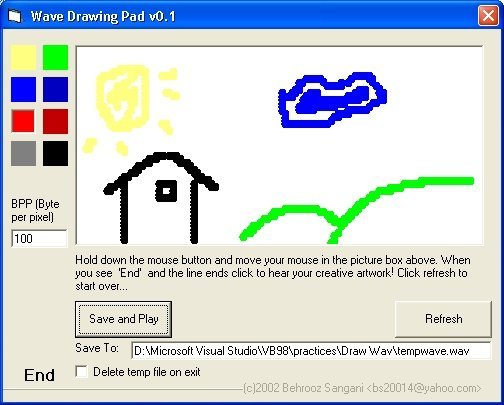

## Wave Drawing Pad v0\.1

### Description

Paint pad that plays your drawings. Draw a picture and hear the sound of your colors! It plays a tone based on your mouse x and y position and the color you choose. See screenshot.... It's a fun program I plan to develop but first I need comments about it to see if it really worths working on.
 
### More Info
 

             |
---                |---
**Submitted On**   |2002-06-05 15:17:24
**By**             |[Behrooz Sangani](https://github.com/Planet-Source-Code/PSCIndex/blob/master/ByAuthor/behrooz-sangani.md)
**Level**          |Intermediate
**User Rating**    |4.8 (29 globes from 6 users)
**Compatibility**  |VB 6\.0
**Category**       |[Sound/MP3](https://github.com/Planet-Source-Code/PSCIndex/blob/master/ByCategory/sound-mp3__1-45.md)
**World**          |[Visual Basic](https://github.com/Planet-Source-Code/PSCIndex/blob/master/ByWorld/visual-basic.md)
**Archive File**   |[Wave\_Drawi90581652002\.zip](https://github.com/Planet-Source-Code/behrooz-sangani-wave-drawing-pad-v0-1__1-35497/archive/master.zip)

